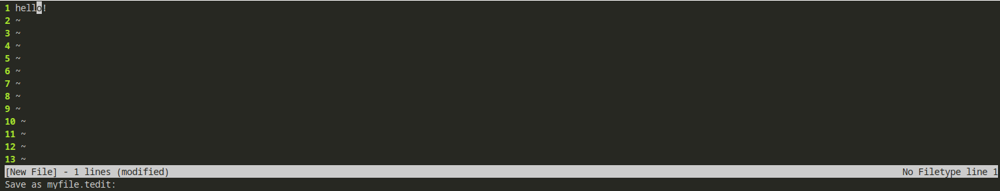

## werdl/utils
### Simple command-line utilities
- These were all seperate repos, until I realised they can all live happily in a monorepo `:)`
## List
- [style](style) - `md/c` My C stylistic guide
- [tedit](tedit) - `c` A simple text editor
- [wsh](wsh) - `c` A simple shell
- [wsvc](wsvc) - `py` A version control system
- [xtra](xtra) - `c` Some bonus C headers to make your life easier

## Screenshot
